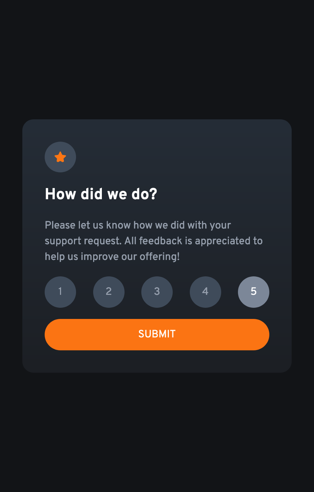

# Frontend Mentor - Interactive rating component solution

This is a solution to the [Interactive rating component challenge on Frontend Mentor](https://www.frontendmentor.io/challenges/interactive-rating-component-koxpeBUmI). Frontend Mentor challenges help you improve your coding skills by building realistic projects.

## Table of contents

- [Overview](#overview)
  - [The challenge](#the-challenge)
  - [Screenshots](#screenshots)
    - [Desktop](#desktop)
    - [Mobile](#mobile)
  - [Links](#links)
- [My process](#my-process)
  - [Built with](#built-with)
  - [What I learned](#what-i-learned)
  - [Continued development](#continued-development)
  - [Useful resources](#useful-resources)
- [Author](#author)

## Overview

### The challenge

Users should be able to:

- View the optimal layout for the app depending on their device's screen size ✅
- See hover states for all interactive elements on the page ✅
- Select and submit a number rating ✅
- See the "Thank you" card state after submitting a rating ✅

### Screenshots

#### Desktop

#### Mobile

### Links

- Live Site URL: [https://almanzarsaul.github.io/frontend-mentor-interactive-rating/](https://almanzarsaul.github.io/frontend-mentor-interactive-rating/)

## My process

### Built with

- Semantic HTML5 markup
- CSS custom properties
- CSS Grid
- Mobile-first workflow
- JavaScript

### What I learned

How to put objects in a circle using padding.

### Continued development

I would like to clean up my CSS. Need to continue to study CSS BEM conventions and how to write better properties.

### Useful resources

- [cssgradient.io](https://cssgradient.io/) - Very easy to use CSS gradient generator. I used it for the background of the card.

## Author

- GitHub - [Saul Almanzar](https://www.github.com/almanzarsaul)
- Frontend Mentor - [@almanzarsaul](https://www.frontendmentor.io/profile/almanzarsaul)
